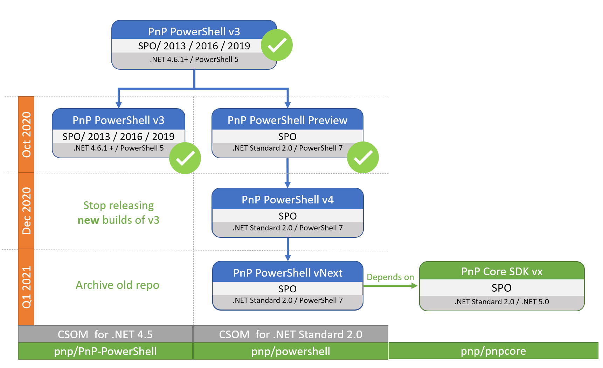

# PnP PowerShell  #

> **PnP-PowerShell Repository - ARCHIVED**
> Important: PnP-PowerShell has been retired and archived. Move to the new PnP PowerShell module available at https://github.com/pnp/powershell. We will only maintain that version going forward.

### Summary ###
This solution contains a library of PowerShell commands that allows you to perform complex provisioning and artifact management actions towards SharePoint. The commands use a combination of CSOM and REST behind the scenes, and can work against both SharePoint Online as SharePoint On-Premises.

# I've found a bug, where do I need to log an issue or create a PR

Only [PnP.PowerShell](https://github.com/pnp/powershell) is actively maintained. 

Given that the cross-platform PnP PowerShell is our future going forward create issues and PRs in the new https://github.com/pnp/powershell repository.

---
This project has adopted the [Microsoft Open Source Code of Conduct](https://opensource.microsoft.com/codeofconduct/). For more information see the [Code of Conduct FAQ](https://opensource.microsoft.com/codeofconduct/faq/) or contact [opencode@microsoft.com](mailto:opencode@microsoft.com) with any additional questions or comments.

 
